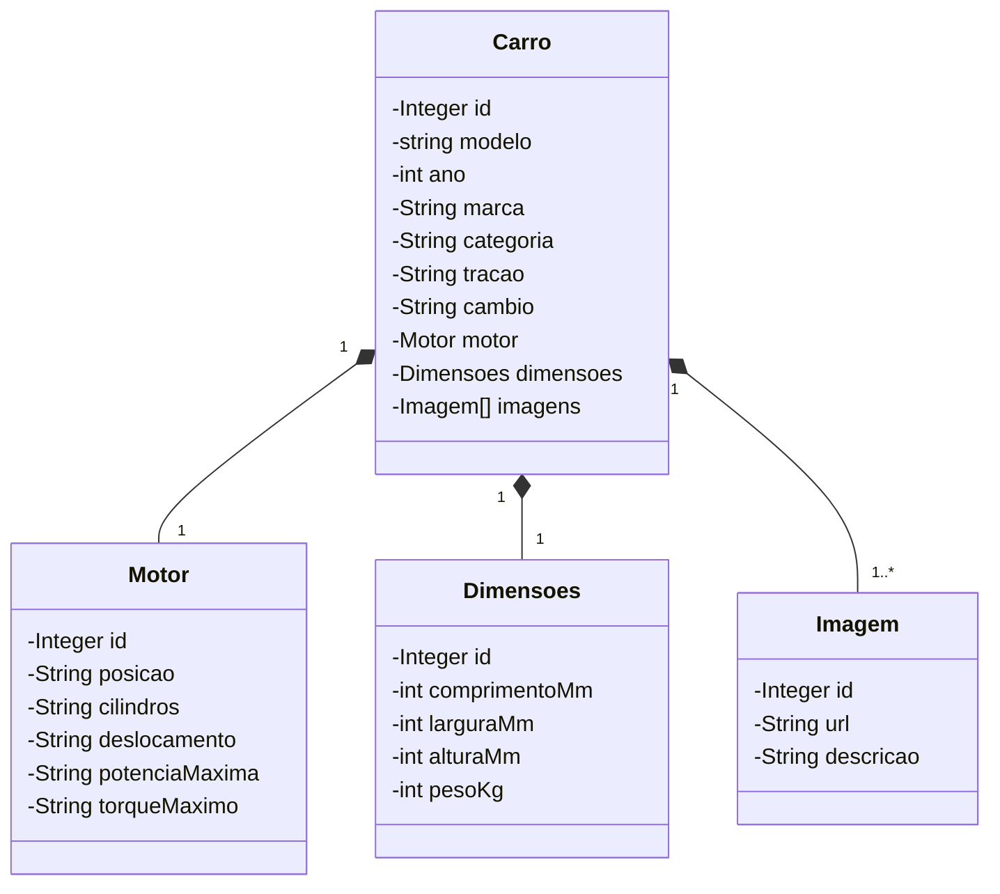

# Car API RESTful 

## Diagrama de Classes (Domínio da API)

```mermaid
classDiagram
    class Carro {
        -Integer id
        -string modelo
        -int ano
        -String marca
        -String categoria
        -String tracao
        -String cambio
        -Motor motor
        -Dimensoes dimensoes
        -Imagem[] imagens
    }

    class Motor {
        -Integer id
        -String posicao
        -String cilindros
        -String deslocamento
        -String potenciaMaxima
        -String torqueMaximo
    }

    class Dimensoes {
        -Integer id
        -int comprimentoMm
        -int larguraMm
        -int alturaMm
        -int pesoKg
    }

    class Imagem {
        -Integer id
        -String url
        -String descricao
    }

    Carro "1" *-- "1" Motor 
    Carro "1" *-- "1" Dimensoes 
    Carro "1" *-- "1..*" Imagem 

```
